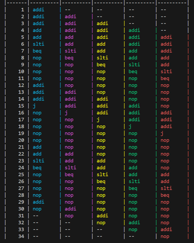
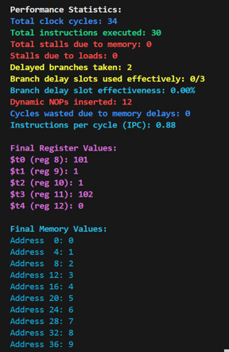
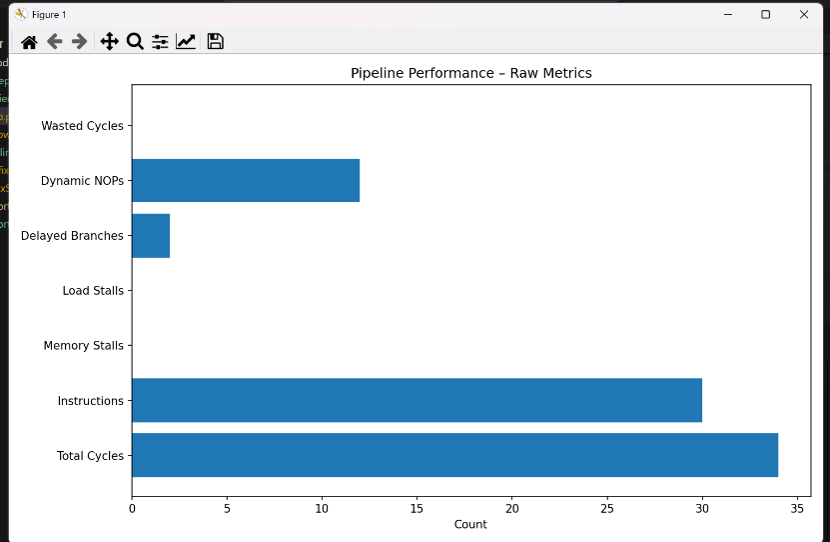
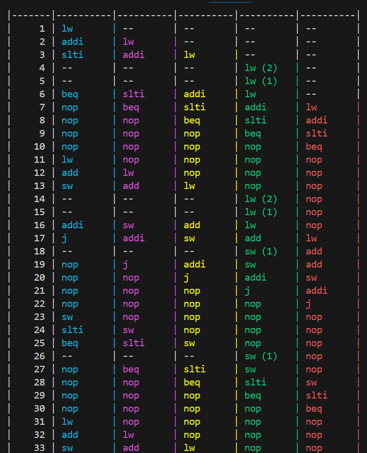
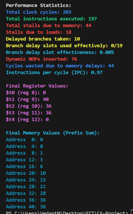
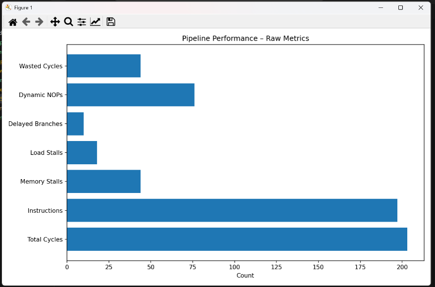
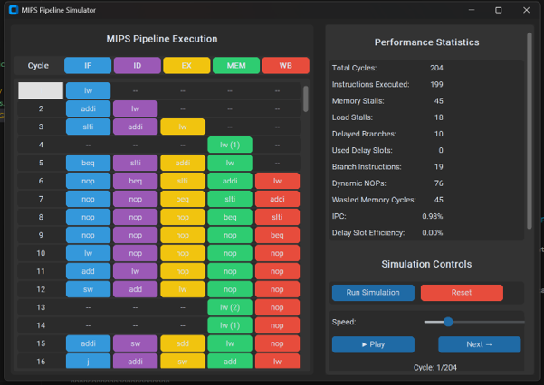
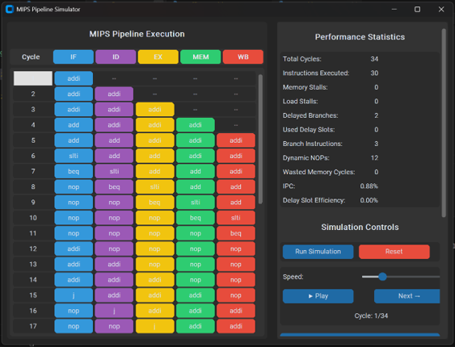

# 🚀 5-Stage Pipelined MIPS Processor Simulator

A Python-based simulation of a **5-stage pipelined MIPS processor** featuring advanced architectural enhancements including **Delayed Branch Execution** and **Multi-Cycle Memory Access**. The project models realistic processor behavior, hazard handling mechanisms, pipeline timing, and performance analysis through detailed visualization and statistics.

---

## 📖 Overview

Traditional pipelined processors face performance challenges due to:

* **Control Hazards** caused by branch instructions.
* **Data Hazards** caused by instruction dependencies.
* **Memory Latency** introduced by slow memory operations.

This simulator extends a standard MIPS pipeline by introducing:

✅ Branch Delay Slots
✅ Variable Memory Latency
✅ Hazard Detection and Resolution
✅ Data Forwarding
✅ Pipeline Stall Management
✅ Performance Metrics and Visualization

---

## 🏗️ Pipeline Architecture

The processor follows the classic **5-stage MIPS pipeline**:

| Stage | Description        |
| ----- | ------------------ |
| IF    | Instruction Fetch  |
| ID    | Instruction Decode |
| EX    | Execute            |
| MEM   | Memory Access      |
| WB    | Write Back         |

```text
IF → ID → EX → MEM → WB
```

---

## ✨ Key Features

### 1. Delayed Branch Execution

Instead of flushing the pipeline whenever a branch is encountered, the processor uses a **branch delay slot**.

#### How it works

* The instruction immediately following a branch is always executed.
* Branch decisions are resolved in the EX stage.
* Branch targets are computed and applied after the delay slot completes.
* NOPs are inserted to model branch timing behavior.

#### Benefits

* Reduces control hazard penalties.
* Improves pipeline utilization.
* Eliminates costly pipeline flushes.

---

### 2. Multi-Cycle Memory Access

Memory operations are extended beyond a single clock cycle to emulate realistic memory systems.

#### Features

* `lw` and `sw` instructions require **2–3 cycles**.
* Memory latency is randomly selected.
* Pipeline stages are stalled when memory is busy.
* Correct execution order is maintained.

#### Benefits

* Models realistic memory behavior.
* Demonstrates the impact of memory bottlenecks.
* Allows analysis of latency-induced performance degradation.

---

### 3. Hazard Detection and Resolution

#### Data Hazards

The simulator implements forwarding to resolve RAW hazards.

Forwarding priority:

```text
MEM/WB → EX/MEM → Register File
```

Load-use hazards are detected automatically and resolved through stalling.

#### Control Hazards

Managed through:

* Delayed Branch Execution
* Branch Delay Slots
* Controlled NOP insertion

---

### 4. Pipeline Visualization

The simulator generates a colored timing diagram using **Colorama**.

| Stage | Color   |
| ----- | ------- |
| IF    | Cyan    |
| ID    | Magenta |
| EX    | Yellow  |
| MEM   | Green   |
| WB    | Red     |

This provides a cycle-by-cycle view of instruction flow through the pipeline.

---

## 📊 Performance Metrics

The simulator automatically collects and reports detailed statistics.

### Execution Statistics

| Metric                       | Description                               |
| ---------------------------- | ----------------------------------------- |
| Total Clock Cycles           | Overall execution time                    |
| Total Instructions Executed  | Dynamic instruction count                 |
| Instructions Per Cycle (IPC) | Pipeline efficiency                       |
| Branch Instructions          | Number of branch/jump instructions        |
| Delayed Branches Taken       | Successfully executed delayed branches    |
| Branch Delay Slot Usage      | Useful instructions placed in delay slots |
| Dynamic NOPs Inserted        | Control hazard mitigation overhead        |
| Memory Stall Cycles          | Cycles lost due to memory latency         |
| Load Hazard Stalls           | Cycles lost due to load-use hazards       |

---

# 📷 Screenshots & Demonstrations

## 1. Arithmetic Loop Execution

This test program repeatedly increments three registers and continues execution until their cumulative sum exceeds a predefined threshold. The objective is to demonstrate:

* Arithmetic instruction execution
* Loop control using branches
* Delayed branch handling
* Pipeline progression across iterations

### Execution Output 1

<p align="center">
  
</p>

### Execution Output 2

<p align="center">
  
</p>

### Execution Output 3

<p align="center">
  
</p>

---

## 2. Load/Store Program with Multi-Cycle Memory Access

This program exercises memory-intensive instructions (`lw` and `sw`) to evaluate the effects of variable memory latency on pipeline performance.

Features demonstrated:

* Multi-cycle memory access
* Memory stalls
* Load-use hazard detection
* Data forwarding
* Pipeline synchronization

### Execution Output 1

<p align="center">
  
</p>

### Execution Output 2

<p align="center">
  
</p>

### Execution Output 3

<p align="center">
  
</p>

---

## 3. Graphical User Interface (GUI)

The project includes a GUI-based visualization environment that allows users to inspect processor execution and pipeline behavior interactively.

Features:

* Pipeline stage visualization
* Instruction tracking
* Register monitoring
* Memory inspection
* Performance statistics

### GUI Demonstration 1

<p align="center">
  
</p>

### GUI Demonstration 2

<p align="center">
  
</p>

---

## 📈 Sample Results

Typical execution statistics observed during testing:

| Metric                   | Approximate Value |
| ------------------------ | ----------------- |
| Total Cycles             | 50 – 70           |
| Instructions Executed    | 130 – 140         |
| IPC                      | 1.86 – 2.80       |
| Memory Stall Cycles      | 20 – 30           |
| Load Hazard Stalls       | 5 – 10            |
| Branch Instructions      | 11                |
| Delay Slot Effectiveness | 45% – 65%         |
| Dynamic NOPs Inserted    | 40 – 44           |

---

## 🔄 Branch Delay Slot Analysis

### Advantages

* Eliminates pipeline flush penalties.
* Improves control hazard handling.
* Keeps useful work in the pipeline.

### Observations

Current implementation inserts four NOPs after branch detection.

While functional, this may introduce unnecessary overhead.

Potential improvement:

```text
Current: 4 NOPs
Suggested: 1 True Delay Slot
```

This would more closely resemble actual MIPS implementations.

---

## 🧠 Memory Latency Analysis

Introducing multi-cycle memory access provides a realistic representation of modern systems.

### Effects

* Increased total execution cycles.
* Reduced throughput.
* Additional load-use hazard stalls.

### Trade-Off

| Benefit                         | Cost                  |
| ------------------------------- | --------------------- |
| Realistic memory model          | Increased stalls      |
| Better architectural simulation | Lower IPC             |
| Demonstrates latency effects    | Longer execution time |

---

## 📷 Demonstrations

### Prefix Sum Program

Simulation of a prefix-sum algorithm operating on memory locations.

Features demonstrated:

* Loop execution
* Branch handling
* Register forwarding
* Memory access
* Hazard resolution

---

### Load/Store Intensive Program

Demonstrates:

* `lw` execution
* `sw` execution
* Variable memory latency
* Stall generation
* Pipeline synchronization

---

### GUI Visualization

A graphical interface is included for:

* Pipeline monitoring
* Instruction tracking
* Stage visualization
* Execution analysis

---

## 🔮 Future Improvements

### Branch Prediction

Implement dynamic branch prediction strategies:

* 1-bit predictor
* 2-bit saturating predictor
* Tournament predictor

### Memory Pipelining

Allow overlapping memory accesses to reduce latency impact.

### Cache Simulation

Add:

* Direct-Mapped Cache
* Set-Associative Cache
* Fully Associative Cache

### Advanced Visualization

* Interactive pipeline diagrams
* Performance graphs
* Hazard heatmaps

---

## 🎯 Learning Outcomes

This project demonstrates practical understanding of:

* Computer Architecture
* Instruction Pipelining
* Hazard Detection
* Data Forwarding
* Branch Handling
* Pipeline Stalls
* Memory Systems
* Performance Evaluation

---

## 🛠️ Technologies Used

| Technology         | Purpose                        |
| ------------------ | ------------------------------ |
| Python             | Core Simulator                 |
| Colorama           | Colored Terminal Visualization |
| Tkinter/Python GUI | Graphical Interface            |
| MIPS ISA           | Processor Model                |

---

## 📜 License

This project is intended for educational and academic use.
